# 🔒 Container Image Security Scanner

[](https://github.com/your-org/image-scanner/actions/workflows/container-scan.yml)
[](https://opensource.org/licenses/MIT)

An enterprise-grade container image security scanner that automatically discovers, scans, and reports vulnerabilities across your container infrastructure. Built for both local development and CI/CD pipeline integration with comprehensive historical tracking and trend analysis.

## 🏗️ System Architecture

```mermaid
graph TB
    subgraph "🔍 Input Sources"
        A[📁 Helm Charts] --> B[🔎 Image Discovery Engine]
        C[👤 Manual Input] --> B
        D[📋 Discovered Lists] --> B
    end
    
    subgraph "⚡ Core Scanning Engine"
        B --> E[🎛️ Resource Management]
        E --> F[🔄 Parallel Orchestration]
        F --> G[🛡️ Trivy Scanner]
        F --> H[🔍 Grype Scanner]  
        F --> I[📦 Syft SBOM]
    end
    
    subgraph "🧹 Vulnerability Processing"
        G --> J[📊 Vulnerability Data]
        H --> K[📊 Grype Results]
        I --> L[📋 SBOM Data]
        J --> M[🛡️ CVE Suppression]
        K --> M
        M --> N[✅ Filtered Results]
    end
    
    subgraph "📈 Report Generation"
        N --> O[📊 Executive Summary]
        N --> P[📋 Detailed Analysis]
        N --> Q[🎯 Action Items]
        L --> O
    end
    
    subgraph "💾 Storage & History"
        O --> R[📚 Historical Archive]
        P --> R
        Q --> S[⚡ Latest Reports]
        R --> T[🗑️ 6-Month Retention]
    end
    
    subgraph "🔗 CI/CD Integration"
        O --> U[🤖 GitHub Actions]
        U --> V[📝 Auto Commits]
        U --> W[💬 PR Comments]
        U --> X[🚨 Issue Creation]
        O --> Y[📈 Trend Analysis]
    end
```



## ✨ Key Features

### 🔍 **Comprehensive Scanning**
- **Multi-Engine Support**: Trivy, Grype, and Syft for complete coverage
- **Parallel Processing**: Resource-aware parallel scanning for maximum performance
- **SBOM Generation**: Complete Software Bill of Materials in SPDX format
- **Cross-Platform**: Works on Linux, macOS, and Windows

### 📊 **Advanced Reporting**
- **Executive Summaries**: High-level security posture dashboards
- **Detailed Analysis**: In-depth vulnerability reports with remediation guidance
- **Trend Analysis**: Historical comparison and security posture tracking
- **Multiple Formats**: JSON, Markdown, and SPDX outputs

### 🛡️ **Risk Management**
- **CVE Suppression**: Manage accepted security risks with proper documentation
- **Severity Filtering**: Configurable thresholds (LOW, MEDIUM, HIGH, CRITICAL)
- **Risk Assessment**: Automated criticality analysis and prioritization

### 🤖 **CI/CD Integration**
- **GitHub Actions**: Native workflow integration
- **Automated Alerts**: Critical vulnerability notifications
- **Historical Tracking**: 6-month retention with automated cleanup
- **PR Integration**: Security summaries on pull requests

## 🚀 Quick Start

### Prerequisites

```bash
# Required dependencies
- Docker (20.0+)
- Bash (4.0+)
- jq (1.6+)
- curl/wget

# Optional but recommended
- Docker Compose
- yq (YAML processor)
```

### 1. Installation

```bash
# Clone the repository
git clone https://github.com/your-org/image-scanner.git
cd image-scanner

# Make scripts executable
chmod +x scripts/*.sh
```

### 2. Basic Usage

```bash
# Scan all discovered images
./scripts/dimpact-image-scanner.sh

# Scan a specific image
./scripts/dimpact-image-scanner.sh --image nginx:latest

# Test mode (scan first 3 images only)
./scripts/dimpact-image-scanner.sh --testmode

# Generate reports from existing scans
./scripts/dimpact-image-report.sh --output-dir ./scan-results
```

### 3. Docker Compose (Recommended)

```bash
# Build and run with Docker Compose
docker-compose up --build

# Scan specific image with Docker Compose
docker-compose run --rm scanner --image alpine:latest
```

## 📋 Detailed Usage Guide

### Command Line Options

#### Scanner Script (`dimpact-image-scanner.sh`)

```bash
Usage: ./scripts/dimpact-image-scanner.sh [OPTIONS]

🔍 Scanning Options:
  --image IMAGE            Scan specific container image
  --helm-charts-dir DIR    Helm charts directory (default: ./helm-charts)
  --use-discovered         Use discovered.yaml instead of live discovery
  --list-images           Only discover and list images (no scanning)

⚙️ Configuration Options:
  --severity LEVEL        Severity threshold: LOW|MEDIUM|HIGH|CRITICAL
  --output-dir DIR        Output directory (default: ./YYMMDD-scan-results)
  --performance MODE      Resource allocation: normal|high|max
  --config-file FILE      Scanner configuration file

🛠️ Execution Modes:
  --testmode             Scan first 3 images only (development)
  --strict               Fail-fast mode (exit on any error)
  --debug                Verbose output and error details
  --update-db            Force update vulnerability databases
  --clean-cache          Clean scanner caches and temp files

📚 Examples:
  # Standard scan with high performance
  ./scripts/dimpact-image-scanner.sh --performance max
  
  # Strict mode with custom output
  ./scripts/dimpact-image-scanner.sh --strict --output-dir ./security-scan
  
  # Debug a specific image
  ./scripts/dimpact-image-scanner.sh --debug --image redis:latest
```

#### Report Generator (`dimpact-image-report.sh`)

```bash
Usage: ./scripts/dimpact-image-report.sh [OPTIONS]

📊 Report Options:
  --input-dir DIR         Input directory with scan results
  --output-dir DIR        Output directory for reports
  --config-file FILE      Configuration file for reporting
  --cve-suppressions FILE CVE suppression file (default: cve-suppressions.md)

📈 Report Types Generated:
  - SECURITY_SUMMARY.md   Executive dashboard with key metrics
  - DETAILED_REPORT.md    Complete vulnerability analysis
  - TREND_ANALYSIS.md     Historical comparison (if available)
```

### Configuration Files

#### CVE Suppressions (`cve-suppressions.md`)

Manage accepted security risks with proper documentation:

```markdown
| CVE ID | Severity | Description | Risk Accepted By | Date | Justification | Review Date |
|--------|----------|-------------|------------------|------|---------------|-------------|
| CVE-2023-45853 | MEDIUM | zlib memory leak | Security Team | 2024-01-15 | Not exploitable in container environment | 2024-04-15 |
```

#### Scanner Configuration (`scan-config/trivy.yaml`)

```yaml
# Trivy Configuration
vulnerability:
  type: [os, library]
  severity: [UNKNOWN, LOW, MEDIUM, HIGH, CRITICAL]
format: json
timeout: 5m
ignore-unfixed: false
```

## 🔧 Advanced Configuration

### Performance Optimization

The scanner supports three performance modes:

| Mode | Resource Usage | Best For |
|------|---------------|----------|
| `normal` | 50% available | Development, limited resources |
| `high` | 75% available | CI/CD pipelines |
| `max` | 100% available | Dedicated scan servers |

```bash
# Set performance mode
export PERFORMANCE_MODE=max
./scripts/dimpact-image-scanner.sh
```

### Environment Variables

```bash
# Core configuration
export SEVERITY_THRESHOLD=HIGH
export OUTPUT_DIR=./custom-scans
export HELM_CHARTS_DIR=./charts

# Performance settings
export PERFORMANCE_MODE=high
export PARALLEL_SCANS=4

# Scanner versions
export TRIVY_VERSION=aquasec/trivy:0.45.0
export GRYPE_VERSION=anchore/grype:v0.65.0
```

### GitHub Actions Integration

Add to your `.github/workflows/` directory:

```yaml
name: Security Scan
on:
  schedule:
    - cron: '0 2 * * 1'  # Weekly Monday 2 AM
  workflow_dispatch:

jobs:
  security-scan:
    uses: ./.github/workflows/container-scan.yml
    with:
      severity_threshold: 'HIGH'
```

## 📊 Understanding Reports

### Executive Summary
- **Risk Level Assessment**: Overall security posture
- **Vulnerability Counts**: By severity across all images
- **Top Priority Actions**: Critical items requiring immediate attention
- **Trend Analysis**: Comparison with historical scans

### Detailed Reports
- **Per-Image Analysis**: Detailed vulnerability breakdown
- **CVE Details**: Links to vulnerability databases
- **Remediation Guidance**: Specific fix recommendations
- **SBOM Information**: Complete software inventory

### Report Structure

```
scan-results/
├── SECURITY_SUMMARY.md      # Executive dashboard
├── DETAILED_REPORT.md       # Complete analysis
├── image-name/
│   ├── trivy-results.json   # Raw scan data
│   ├── grype-results.json   # Grype findings
│   └── sbom.spdx.json      # Software Bill of Materials
└── metadata/
    └── scan-metadata.json   # Scan information
```

## 🔄 CI/CD Pipeline Integration

### Automated Workflows

The system automatically:
1. **Discovers** container images from Helm charts
2. **Scans** for vulnerabilities using multiple engines
3. **Filters** results using CVE suppressions
4. **Generates** comprehensive reports
5. **Commits** results to repository history
6. **Creates** GitHub issues for critical findings
7. **Maintains** 6-month historical archive

### Integration Points

- **Pull Requests**: Automated security comments
- **Issues**: Critical vulnerability tracking
- **Artifacts**: Report downloads and archives
- **Notifications**: Team alerts for high-risk findings

## 🐛 Troubleshooting

### Common Issues

#### Permission Errors
```bash
# Fix Docker permissions
sudo usermod -aG docker $USER
newgrp docker

# Verify access
docker run hello-world
```

#### Resource Limitations
```bash
# Check Docker resources
docker system info

# Clean up space
docker system prune -a
./scripts/dimpact-image-scanner.sh --clean-cache
```

#### Network Issues
```bash
# Test connectivity
curl -I https://registry-1.docker.io/v2/

# Update vulnerability databases
./scripts/dimpact-image-scanner.sh --update-db
```

### Debug Mode

Enable verbose logging for troubleshooting:

```bash
./scripts/dimpact-image-scanner.sh --debug --testmode
```

### Performance Issues

```bash
# Monitor resource usage
docker stats

# Use lower performance mode
./scripts/dimpact-image-scanner.sh --performance normal
```

## 📚 Additional Resources

- **Software Requirements**: See [software-requirements.md](software-requirements.md)
- **CVE Suppression Guide**: [cve-suppressions.md](cve-suppressions.md)
- **Configuration Examples**: [CONTAINER_CONFIG_EXAMPLES.md](CONTAINER_CONFIG_EXAMPLES.md)
- **Cross-Platform Setup**: [CROSS_PLATFORM_COMPATIBILITY.md](CROSS_PLATFORM_COMPATIBILITY.md)

## 🤝 Contributing

We welcome contributions! Please see our contributing guidelines and feel free to submit issues or pull requests.

## 📄 License

This project is licensed under the MIT License - see the [LICENSE](LICENSE) file for details.

---

**🔒 Secure your containers. 📊 Track your progress. 🚀 Scale with confidence.**
