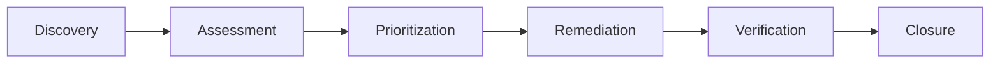

# Container Image Scanning: Ideas and Best Practices

This document provides useful ideas, advanced concepts, and best practices for container image security scanning beyond the basic implementation.

## 🚀 Advanced Scanning Strategies

### 1. Multi-Stage Scanning Pipeline

**Concept**: Implement scanning at different stages of the container lifecycle:

```yaml
# Example workflow stages
stages:
  - build-time-scan    # Scan during image build
  - pre-deployment    # Scan before deployment
  - runtime-scan      # Scan running containers
  - scheduled-scan    # Regular vulnerability updates
```

**Benefits**:
- Early vulnerability detection
- Reduced deployment risks
- Continuous security monitoring
- Compliance with security policies

### 2. Risk-Based Scanning

**Concept**: Prioritize scanning based on image criticality and exposure:

```yaml
# Example risk matrix
risk_levels:
  critical:
    - production-facing images
    - images with sensitive data
    - privileged containers
  high:
    - internal services
    - database containers
  medium:
    - development tools
    - testing utilities
```

### 3. Differential Scanning

**Concept**: Only scan changes between image versions:

```bash
# Compare two image versions
trivy image --format json image:v1.0 > v1.json
trivy image --format json image:v1.1 > v1.1.json
# Custom script to compare and highlight new vulnerabilities
```

## 🔍 Advanced Tool Integration

### 1. Custom Vulnerability Databases

**Idea**: Integrate private vulnerability feeds:

```yaml
# Custom Trivy config
db:
  custom-sources:
    - url: "https://internal-vuln-db.company.com"
      format: "oval"
    - url: "https://vendor-specific-advisories.com"
      format: "json"
```

### 2. Policy-as-Code Integration

**Tools to Consider**:
- **Open Policy Agent (OPA)**: Define security policies as code
- **Falco**: Runtime security monitoring
- **Polaris**: Kubernetes configuration validation

```yaml
# Example OPA policy
package container.security

deny[msg] {
    input.vulnerabilities[_].severity == "CRITICAL"
    msg := "Critical vulnerabilities not allowed in production"
}
```

### 3. SBOM-Driven Security

**Advanced SBOM Usage**:
- License compliance checking
- Supply chain risk assessment
- Dependency vulnerability tracking
- Regulatory compliance reporting

```bash
# Generate enhanced SBOM with license info
syft image:latest -o spdx-json --include-license-info
```

## 📊 Metrics and Analytics

### 1. Security Metrics Dashboard

**Key Metrics to Track**:
- Vulnerability density (vulns per image)
- Mean time to remediation (MTTR)
- Security debt accumulation
- Compliance score trends

### 2. Vulnerability Lifecycle Management



### 3. Risk Scoring Algorithm

```python
# Example risk calculation
def calculate_risk_score(vulnerability):
    base_score = vulnerability.cvss_score
    exploitability = get_exploitability_factor(vulnerability)
    exposure = get_exposure_factor(image_deployment)
    business_impact = get_business_impact(affected_service)
    
    return base_score * exploitability * exposure * business_impact
```

## 🛡️ Security Hardening Ideas

### 1. Distroless Images

**Concept**: Use minimal base images to reduce attack surface:

```dockerfile
# Example distroless image
FROM gcr.io/distroless/java:11
COPY app.jar /app.jar
ENTRYPOINT ["java", "-jar", "/app.jar"]
```

**Benefits**:
- Fewer packages = fewer vulnerabilities
- Smaller image size
- Reduced attack surface

### 2. Multi-Architecture Scanning

**Concept**: Scan images for different architectures:

```yaml
strategy:
  matrix:
    arch: [amd64, arm64, s390x]
    image: ${{ matrix.images }}
```

### 3. Signature Verification

**Tools**:
- **Cosign**: Sign and verify container images
- **Notary**: Docker content trust
- **in-toto**: Supply chain security framework

```bash
# Sign image with cosign
cosign sign --key cosign.key image:tag

# Verify signature
cosign verify --key cosign.pub image:tag
```

## 🔄 CI/CD Integration Patterns

### 1. Quality Gates

**Implementation**:
```yaml
quality_gates:
  - name: "No Critical Vulnerabilities"
    condition: "critical_count == 0"
    action: "fail"
  - name: "SBOM Generation"
    condition: "sbom_exists == true"
    action: "require"
  - name: "License Compliance"
    condition: "forbidden_licenses == 0"
    action: "warn"
```

### 2. Automated Remediation

**Strategies**:
- Auto-update base images
- Dependency version bumping
- Security patch automation
- Alternative package suggestions

### 3. Rollback Mechanisms

**Concept**: Automatic rollback on security issues:

```yaml
- name: Security Check
  run: |
    if [ "$CRITICAL_VULNS" -gt 0 ]; then
      echo "Critical vulnerabilities found, triggering rollback"
      gh workflow run rollback.yml
      exit 1
    fi
```

## 🌐 Enterprise Integration

### 1. SIEM Integration

**Data Export**:
```bash
# Export scan results to SIEM
jq '.Results[].Vulnerabilities[] | {
  timestamp: now,
  image: .PkgName,
  cve: .VulnerabilityID,
  severity: .Severity,
  score: .CVSS.nvd.V3Score
}' trivy-results.json | curl -X POST -d @- https://siem.company.com/api/events
```

### 2. Compliance Reporting

**Standards Support**:
- SOC 2 Type II
- ISO 27001
- NIST Cybersecurity Framework
- PCI DSS
- HIPAA

### 3. Vulnerability Management Integration

**Tools**:
- Qualys VMDR
- Rapid7 InsightVM
- Tenable.io
- ServiceNow Security Operations

## 🎯 Specialized Scanning Scenarios

### 1. Air-Gapped Environments

**Strategies**:
- Offline vulnerability databases
- Sneakernet updates
- Internal mirror registries
- Custom scanning infrastructure

### 2. Multi-Cloud Scanning

**Considerations**:
- Registry authentication across clouds
- Network connectivity requirements
- Cost optimization strategies
- Compliance with regional regulations

### 3. Edge Computing

**Challenges**:
- Limited bandwidth for updates
- Intermittent connectivity
- Resource constraints
- Remote management

## 🔧 Custom Tool Development

### 1. Vulnerability Aggregation Service

```python
# Example aggregation service
class VulnerabilityAggregator:
    def __init__(self):
        self.sources = [TrivyScanner(), GrypeScanner(), CustomScanner()]
    
    def aggregate_results(self, image):
        results = []
        for scanner in self.sources:
            results.append(scanner.scan(image))
        return self.deduplicate_and_merge(results)
```

### 2. Custom Reporting Engine

**Features**:
- Executive dashboards
- Technical deep-dive reports
- Trend analysis
- Compliance mapping
- Risk heat maps

### 3. Automated Triage System

**Concept**: ML-based vulnerability prioritization:

```python
# Example ML model for vulnerability triage
def predict_priority(vulnerability):
    features = extract_features(vulnerability)
    priority = ml_model.predict(features)
    return priority  # HIGH, MEDIUM, LOW
```

## 📈 Performance Optimization

### 1. Parallel Scanning

**Strategies**:
- Concurrent image scanning
- Distributed scanning across runners
- Caching strategies for databases
- Incremental scanning

### 2. Resource Management

**Optimization**:
```yaml
resources:
  requests:
    memory: "2Gi"
    cpu: "1000m"
  limits:
    memory: "4Gi"
    cpu: "2000m"
```

### 3. Caching Strategies

**Implementation**:
- Vulnerability database caching
- Image layer caching
- Scan result caching
- SBOM caching

## 🚨 Incident Response Integration

### 1. Automated Alerting

**Channels**:
- Slack/Teams notifications
- PagerDuty integration
- Email alerts
- JIRA ticket creation

### 2. Emergency Response Procedures

**Workflow**:
1. Critical vulnerability detected
2. Automatic impact assessment
3. Stakeholder notification
4. Emergency patching process
5. Verification and closure

### 3. Forensic Analysis

**Capabilities**:
- Image provenance tracking
- Change history analysis
- Attack vector reconstruction
- Timeline generation

## 🔮 Future Trends and Innovations

### 1. AI-Powered Security

**Applications**:
- Intelligent vulnerability prioritization
- Automated patch generation
- Behavioral anomaly detection
- Predictive security analytics

### 2. Zero-Trust Container Security

**Concepts**:
- Runtime attestation
- Continuous verification
- Micro-segmentation
- Identity-based access control

### 3. Quantum-Safe Cryptography

**Preparation**:
- Post-quantum algorithms
- Crypto-agility frameworks
- Migration strategies
- Risk assessment

## 💡 Innovation Ideas

### 1. Vulnerability Marketplace

**Concept**: Crowdsourced vulnerability research and remediation:
- Bug bounty integration
- Community-driven fixes
- Vendor collaboration platform
- Knowledge sharing ecosystem

### 2. Security-as-Code Platform

**Vision**: Complete security automation:
- Policy definition and enforcement
- Automated remediation workflows
- Continuous compliance monitoring
- Self-healing security infrastructure

### 3. Container Security Mesh

**Architecture**: Distributed security enforcement:
- Service mesh integration
- Policy propagation
- Centralized monitoring
- Decentralized enforcement

---

## 📚 Additional Resources

### Research Papers
- "Container Security: Issues, Challenges, and the Road Ahead" (IEEE)
- "A Survey of Container Security" (ACM Computing Surveys)
- "Supply Chain Security for Container Images" (USENIX)

### Industry Reports
- NIST SP 800-190: Application Container Security Guide
- CIS Docker Benchmark
- OWASP Container Security Top 10

### Tools and Frameworks
- SLSA (Supply-chain Levels for Software Artifacts)
- SPIFFE/SPIRE (Secure Production Identity Framework)
- Tekton Chains (Supply chain security for Tekton)

### Communities
- CNCF Security SIG
- Open Source Security Foundation (OpenSSF)
- Container Security Working Groups 
