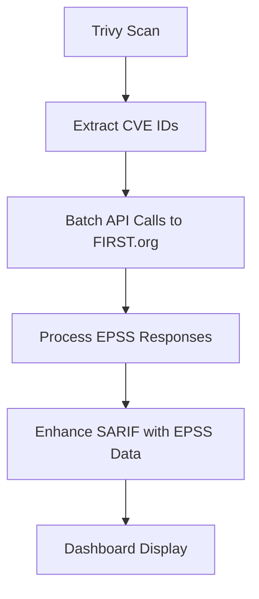

# EPSS Integration Guide

## 🎯 Overview

The Enhanced Container Scanner now includes **EPSS (Exploit Prediction Scoring System)** integration to provide real-time exploitability scores for vulnerabilities. EPSS predicts the probability that a vulnerability will be exploited in the wild within the next 30 days.

## 🚀 Features

### ✅ What's Included

- **Real-time EPSS Score Fetching**: Automatically retrieves EPSS scores from the FIRST.org API
- **SARIF Enhancement**: Embeds EPSS data directly into scan results
- **Dashboard Integration**: Visual display of exploitation risk levels
- **Risk Categorization**: Color-coded risk indicators
- **Batch Processing**: Efficient API calls for multiple CVEs
- **Resilient Design**: Graceful handling of API failures

### 📊 EPSS Risk Levels

| Risk Level | EPSS Score | Color | Description |
|------------|------------|-------|-------------|
| 🟢 **Low** | ≤ 1% | Green | Minimal exploitation risk |
| 🟡 **Medium** | 1-5% | Yellow | Moderate exploitation risk |
| 🟠 **High** | 10-50% | Orange | High exploitation risk |
| 🔴 **Very High** | > 50% | Red | Critical exploitation risk |

## 🔧 How It Works

### 1. **Vulnerability Scanning**
```bash
# Standard scan with EPSS enhancement
./scripts/dimpact-image-scanner.sh --image nginx:latest

# Test mode with EPSS
./scripts/dimpact-image-scanner.sh --testmode
```

### 2. **EPSS Data Flow**


### 3. **SARIF Enhancement**
The scanner automatically:
- Extracts all CVE IDs from scan results
- Fetches EPSS scores in batches (50 CVEs per request)
- Adds EPSS data to SARIF rule properties
- Includes metadata about the enhancement

## 📱 Dashboard Features

### 🏠 Main Dashboard
- **Image Cards**: Show average and maximum EPSS scores
- **High-Risk Indicators**: Count of vulnerabilities with >5% exploitation probability
- **Color-Coded Badges**: Visual risk assessment at a glance

### 🔍 Detailed Modal
- **Comprehensive EPSS Statistics**: Average, maximum, and high-risk counts
- **Individual CVE Scores**: EPSS percentage and percentile for each vulnerability
- **Risk Alerts**: Automated warnings for high-risk images
- **Prioritization Guidance**: Actionable recommendations

## 🛠️ Technical Implementation

### Scanner Integration

The EPSS functionality is integrated into the main scanner script with two key functions:

#### `fetch_epss_scores()`
- Extracts CVE IDs from SARIF files
- Makes batched API calls to `https://api.first.org/data/v1/epss`
- Handles retries and rate limiting
- Provides progress feedback

#### `enhance_sarif_with_epss()`
- Merges EPSS data into SARIF rule properties
- Adds risk categorization (low/medium/high/very_high)
- Includes enhancement metadata and timestamps

### Dashboard Integration

The dashboard JavaScript automatically:
- Parses EPSS data from enhanced SARIF files
- Calculates image-level risk statistics
- Displays color-coded risk indicators
- Shows detailed exploitation probabilities

## 📋 Usage Examples

### Basic Scan with EPSS
```bash
# Scan a single image
./scripts/dimpact-image-scanner.sh --image nginx:1.27.4

# The scanner will automatically:
# 1. Run Trivy scan
# 2. Fetch EPSS scores for all CVEs
# 3. Enhance SARIF with exploitation data
# 4. Update dashboard with risk information
```

### Test EPSS Integration
```bash
# Run the EPSS test script
./test-epss.sh

# This will:
# - Scan nginx:1.27.4 (known to have vulnerabilities)
# - Show EPSS enhancement statistics
# - Provide sample exploitation scores
```

### View Results
```bash
# Start the dashboard
cd docs && python3 -m http.server 8080

# Navigate to http://localhost:8080
# Look for 🎯 EPSS indicators on image cards
```

## 🔍 SARIF Data Structure

### Enhanced Rule Properties
```json
{
  "id": "CVE-2023-6879",
  "properties": {
    "epss": 0.00123,
    "epssPercentile": 0.45678,
    "epssDate": "2025-06-27",
    "epssScore": "low",
    "security-severity": "9.8"
  }
}
```

### Run-Level Metadata
```json
{
  "runs": [{
    "properties": {
      "epssEnhanced": true,
      "epssEnhancementDate": "2025-06-27T10:30:00Z",
      "epssVersion": "1.0"
    }
  }]
}
```

## 🎨 Dashboard Display

### Image Card Example
```
┌─────────────────────────────────────┐
│ nginx:1.27.4                        │
│ 🔥 5  ⚠️ 22  🔶 42  🔵 106         │
│ 📅 Age: 🟡 4 month(s), 13 day(s)   │
│ 🎯 EPSS: 🟠 2.3% avg (3 high-risk) │
└─────────────────────────────────────┘
```

### Modal Details
```
📦 Image Information
• EPSS Risk Score: 🟠 Average: 2.3%, Maximum: 15.7%
• High-Risk CVEs: 3 vulnerabilities with >5% exploitation probability
⚠️ Security Advisory: Prioritize patching high-risk vulnerabilities

🔥 CRITICAL Vulnerabilities (5)
├─ CVE-2023-6879 [12.5% EPSS]
├─ CVE-2025-48174 [0.8% EPSS]
└─ ...
```

## 🔧 Configuration

### API Rate Limiting
The scanner implements respectful API usage:
- **Batch Size**: 50 CVEs per request
- **Request Delay**: 1 second between batches
- **Retry Logic**: 3 attempts with exponential backoff
- **Timeout**: 30 seconds per request

### Error Handling
- **Graceful Degradation**: Continues scanning if EPSS API is unavailable
- **Partial Data**: Displays available EPSS scores even if some CVEs fail
- **Clear Logging**: Detailed progress and error reporting

## 📊 Benefits

### 🎯 **Risk Prioritization**
- Focus on vulnerabilities with highest exploitation probability
- Reduce noise from theoretical vulnerabilities
- Align security efforts with real-world threat landscape

### 📈 **Enhanced Decision Making**
- Combine CVSS severity with exploitation likelihood
- Make informed patching decisions
- Optimize security resource allocation

### 🚀 **Operational Efficiency**
- Automated EPSS integration in existing workflows
- No additional manual steps required
- Real-time threat intelligence

## 🔮 Future Enhancements

### Planned Features
- **EPSS Trend Analysis**: Historical exploitation probability tracking
- **Custom Risk Scoring**: Combine CVSS + EPSS + business context
- **Alert Thresholds**: Configurable notifications for high-risk images
- **Integration APIs**: Export EPSS-enhanced data to security tools

### Advanced Analytics
- **Risk Heat Maps**: Visual representation of container risk landscape
- **Exploitation Forecasting**: Predictive models for vulnerability trends
- **Compliance Reporting**: EPSS-aware security compliance dashboards

## 🆘 Troubleshooting

### Common Issues

#### ❌ "No EPSS data available"
**Cause**: API connectivity issues or no CVEs found
**Solution**: 
```bash
# Check internet connectivity
curl -s https://api.first.org/data/v1/epss | head

# Verify CVEs in SARIF
jq '.runs[].tool.driver.rules[].id' your-sarif-file.sarif | grep CVE
```

#### ❌ "EPSS API timeout"
**Cause**: Network latency or API rate limiting
**Solution**: The scanner automatically retries. For persistent issues:
```bash
# Run with debug mode
./scripts/dimpact-image-scanner.sh --debug --image your-image
```

#### ❌ "Invalid EPSS scores"
**Cause**: Malformed API response or JSON parsing error
**Solution**: Check SARIF file integrity:
```bash
jq empty your-sarif-file.sarif && echo "Valid JSON" || echo "Invalid JSON"
```

### Debug Commands
```bash
# Test EPSS API directly
curl "https://api.first.org/data/v1/epss?cve=CVE-2023-6879&pretty=true"

# Validate SARIF enhancement
jq '.runs[0].properties.epssEnhanced' your-sarif-file.sarif

# Count enhanced vulnerabilities
jq '[.runs[0].tool.driver.rules[] | select(.properties.epss)] | length' your-sarif-file.sarif
```

## 📚 References

- **EPSS Official Site**: https://www.first.org/epss/
- **EPSS API Documentation**: https://api.first.org/epss/
- **EPSS Research Papers**: https://www.first.org/epss/articles
- **FIRST.org**: https://www.first.org/

---

## 🏆 Quick Start

Ready to try EPSS integration? Run this command:

```bash
# Test with nginx (has known vulnerabilities)
./test-epss.sh

# Or scan your own image
./scripts/dimpact-image-scanner.sh --image your-image:tag
```

The scanner will automatically fetch EPSS scores and enhance your vulnerability data with real-world exploitation probabilities! 🎯 
